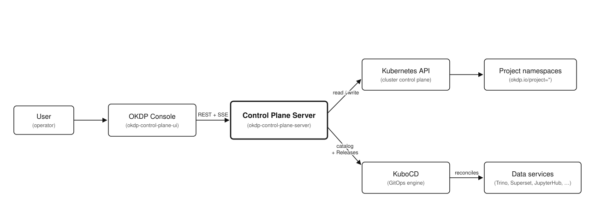

<p align="center">
  <a href="https://okdp.io">
    
  </a>
</p>

[](https://github.com/OKDP/okdp-control-plane-server/actions/workflows/release-please.yml)
[](http://www.apache.org/licenses/LICENSE-2.0)

# OKDP Control Plane Server

Docker image and Helm chart for the backend API of the OKDP web console
([okdp-control-plane-ui](https://github.com/OKDP/okdp-control-plane-ui)): a Go service that
manages OKDP projects and their data services on Kubernetes and exposes them to the console
over REST and Server-Sent Events (SSE).

---

## Why this project

The OKDP web console is a browser single-page application with no cluster credentials and
no server-side logic, so it cannot drive Kubernetes on its own. This repository is its
backend: an API that turns console actions into cluster operations, creating project
namespaces, deploying and updating data services, serving the service catalog, and
streaming their status, pods and metrics.

It is a first-party OKDP component, developed alongside the web console. Cluster credentials
and business logic stay on the server side, keeping the console a stateless browser client.

---

## What the project does

- **Docker image** `quay.io/okdp/images/okdp-server`: runs the Go control-plane API
  server on a minimal Alpine base, listening on port `8093`.
- **Helm chart** (`chart/`): deploys the server in-cluster with the RBAC it needs to
  reach the Kubernetes API and KuboCD.

The image and chart provide the backend for the OKDP web console, so the platform is
driven through the console instead of raw `kubectl` and KuboCD manifests.

Project layout:

- `cmd/server`: entry point.
- `internal/api`: HTTP handlers and router.
- `internal/service`: business logic.
- `internal/repository`: data access (Kubernetes / KuboCD client).
- `internal/config`: configuration loaded from environment variables.
- `chart/`: Helm chart.

---

## Architecture

<p align="center">
  
</p>

> **OKDP deployment context:** the server runs **in-cluster**. It reads the service
> catalog from a KuboCD `Context` and drives deployments by creating KuboCD `Release`
> resources. KuboCD is the GitOps engine already used by OKDP, which is why the server
> integrates with it rather than templating manifests itself. Projects are modeled as
> plain namespaces, so no extra CRD or operator is introduced. Authentication (OIDC)
> and TLS are provided by the platform ingress in front of the server, not by this
> component.

See the [KuboCD documentation](https://github.com/kubotal/kubocd) for the `Context`
and `Release` model the server builds on.

---

## Requirements

- Kubernetes cluster with [KuboCD](https://github.com/kubotal/kubocd) installed (provides the `Context` and `Release` CRDs the server reads and writes)
- A **kubeconfig** with permission to manage namespaces and to read/write KuboCD `Context` and `Release` resources (in-cluster, the chart wires the ServiceAccount RBAC)
- [Go](https://go.dev/) >= 1.25 (only to build the image or run the server locally)

Known-good baseline: chart `0.6.0` with image `0.6.0` and Go `1.25`, on a Kind cluster. This is the version set validated by the maintainers.

### Toolchain tested

| Tool | Version |
|---|---|
| Go | `1.25` |
| Kind | `0.27.0` |
| kubectl | `1.32.2` |

> The server does not need the `helm` or `kubectl` binaries to run: it communicates with the
> Kubernetes API through the client-go library. Helm (>= 3) is needed only to deploy the
> chart, and `kubectl` to inspect the cluster.

---

## Installation

The server runs in-cluster and needs a Kubernetes cluster with [KuboCD](https://github.com/kubotal/kubocd) installed (the `Context` and `Release` CRDs must exist):

```sh
kubectl get crd | grep kubocd
# configs.kubocd.kubotal.io
# contexts.kubocd.kubotal.io
# releases.kubocd.kubotal.io
```

Install the chart from the OKDP registry:

```sh
helm install okdp-control-plane-server oci://quay.io/okdp/charts/okdp-control-plane-server --version 0.6.0 \
  -n okdp-system --create-namespace
```

Once the pod is `Running`, reach the API through a port-forward:

```sh
kubectl port-forward -n okdp-system svc/okdp-control-plane-server 8093:8093
curl -s http://localhost:8093/health
# {"status":"ok"}
```

The Swagger UI is then available at `http://localhost:8093/swagger/index.html`.

---

## Cleanup

Remove the Helm release, and the namespace if it was created only for this install:

```sh
helm uninstall okdp-control-plane-server -n okdp-system
kubectl delete namespace okdp-system
```

---

## Development

### Run the server locally

Both options require a `KUBECONFIG` pointing at a Kubernetes cluster with KuboCD
installed: the server connects to the Kubernetes API at startup.

**On your machine.** Install Go and the development tools (`kubectl`, `kubocd`, `air`,
`swag`, `golangci-lint`, `delve`), then:

```sh
export KUBECONFIG=<path-to-your-kubeconfig>
make dev                 # hot-reload on :8093
# or, without hot-reload:
go run ./cmd/server
```

**In the devcontainer.** Only Docker is required: open the repository and select "Reopen
in Container" (or run `devcontainer up`). The container ships the full toolchain,
publishes port 8093 and syncs a container-reachable copy of the host kubeconfig at
startup. Then run `make dev`.

### Build, test and lint

No cluster is required:

```sh
make build     # compile the binary to bin/server
make test      # run the tests
make lint      # run golangci-lint
make swagger   # regenerate the Swagger documentation
```

Run `make help` for the full list of targets.

---

## Configuration

The server is configured through environment variables, rendered by the chart from
its `configuration:` values (see [`chart/values.yaml`](chart/values.yaml)).

| Parameter | Description | Default | Required |
|-----------|-------------|---------|:--------:|
| `PORT` | HTTP port the server listens on | `8093` | No |
| `PLATFORM_NAMESPACE` | Namespace where the OKDP platform runs | `okdp-system` | No |
| `ALLOWED_ORIGINS` | Single CORS origin, set verbatim in `Access-Control-Allow-Origin` (the console URL) | `http://localhost:4200` | No |
| `LOG_LEVEL` | Log verbosity (`debug`, `info`, `warn`, `error`) | `info` | No |
| `KUBOCD_NAMESPACE` | Namespace where KuboCD runs | `kubocd-system` | No |
| `CONTEXT_NAME` | Name of the KuboCD `Context` holding the service catalog | `default` | No |
| `CONTEXT_NAMESPACE` | Namespace of that `Context` | `kubocd-system` | No |
| `RELEASE_INTERVAL` | Reconcile interval set on created KuboCD `Release`s | `30m` | No |
| `RELEASE_TIMEOUT` | Timeout set on created KuboCD `Release`s | `10m` | No |
| `EXCLUDED_SIDECAR_PREFIXES` | Container name prefixes excluded from pod/metrics views (comma-separated) | `istio-proxy,istio-init,dynatrace-,linkerd-proxy,envoy,vault-agent` | No |

> For the full chart values (image, service, resources, RBAC), see
> [`chart/values.yaml`](chart/values.yaml).

---

## Images

Images are published to [`quay.io/okdp`](https://quay.io/organization/okdp).

| Image | Tag format | Example |
|-------|-----------|---------|
| `quay.io/okdp/images/okdp-server` | `<version>` (matches the chart `appVersion`) | `quay.io/okdp/images/okdp-server:0.6.0` |

> See the [available tags on quay.io](https://quay.io/repository/okdp/images/okdp-server?tab=tags) for all published versions.

---

## Troubleshooting

### The pod restarts in a loop (`CrashLoopBackOff`)

**Cause:** the server builds its Kubernetes client at startup and exits if it cannot.
The logs show `Failed to initialize Kubernetes client: failed to get kubernetes config
(tried in-cluster and local)`. In-cluster this means the ServiceAccount or its RBAC is
missing; for a local run it means `KUBECONFIG` is unset or invalid.

**Fix:** in-cluster, make sure the chart's ServiceAccount and RBAC are applied; locally,
point `KUBECONFIG` at a valid config. Then check the logs and permissions:

```sh
kubectl logs -n okdp-system -l app.kubernetes.io/name=okdp-control-plane-server
kubectl auth can-i list namespaces
```

### API calls fail only in the browser (CORS)

**Cause:** the server returns `Access-Control-Allow-Origin` set verbatim to
`ALLOWED_ORIGINS` (default `http://localhost:4200`). When that value does not match the
origin the console is served from, the browser blocks the response and its console shows
`No 'Access-Control-Allow-Origin' header`. The same requests still work with `curl`.

**Fix:** set `ALLOWED_ORIGINS` to the exact console origin and redeploy.

### The service catalog is empty, or `GET /api/platform-services` returns `500`

**Cause:** the catalog is read from a KuboCD `Context` (`CONTEXT_NAME` in
`CONTEXT_NAMESPACE`, default `default` in `kubocd-system`). A `500` means that Context
is missing, the two variables point to the wrong one, or KuboCD is not installed. An
empty but successful catalog means the Context exists yet has no `okdp.services`.

**Fix:** confirm KuboCD is installed and the Context exists:

```sh
kubectl get crd | grep kubocd
kubectl get context default -n kubocd-system
```

---

## Contributing & License

Contributions follow the [OKDP contribution guide](https://github.com/OKDP/.github/blob/main/CONTRIBUTING.md). Released under the [Apache License 2.0](LICENSE).

---

**Built 🚀 for the OKDP Community**
<a href="https://okdp.io">
  
</a>
